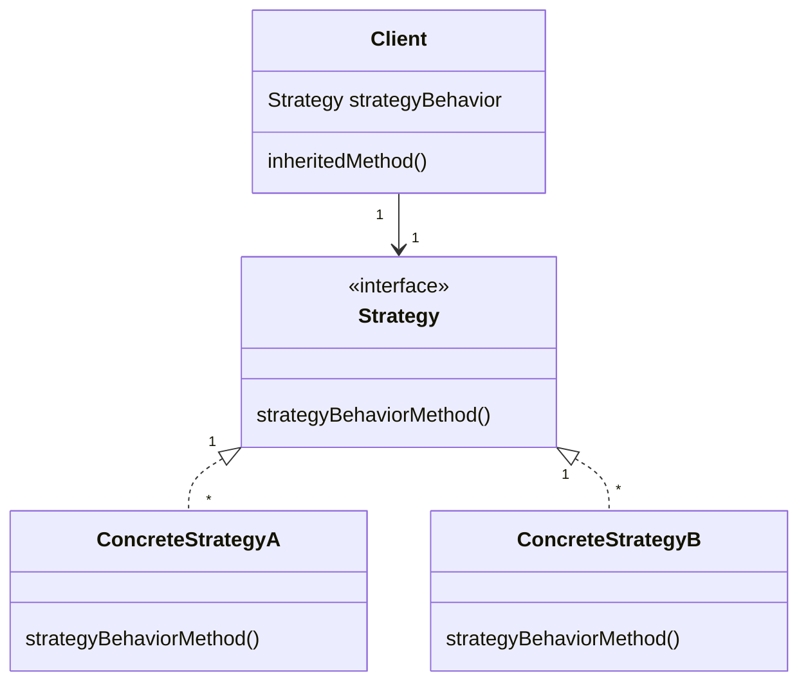

# Chapter 1: Strategy design pattern

> **Strategy**: defines a family of algorithms, encapsulates each one and makes them interchangeable. Strategy lets the algorithm vary independently from clients that use it.

Class Diagram

I think the more pythonic approach would be to define methods rather than classes, and this would not violate the above definition.  The class-based approach is needed in Java and has the advantage of explicitly setting out the required method in an abstract base class.
