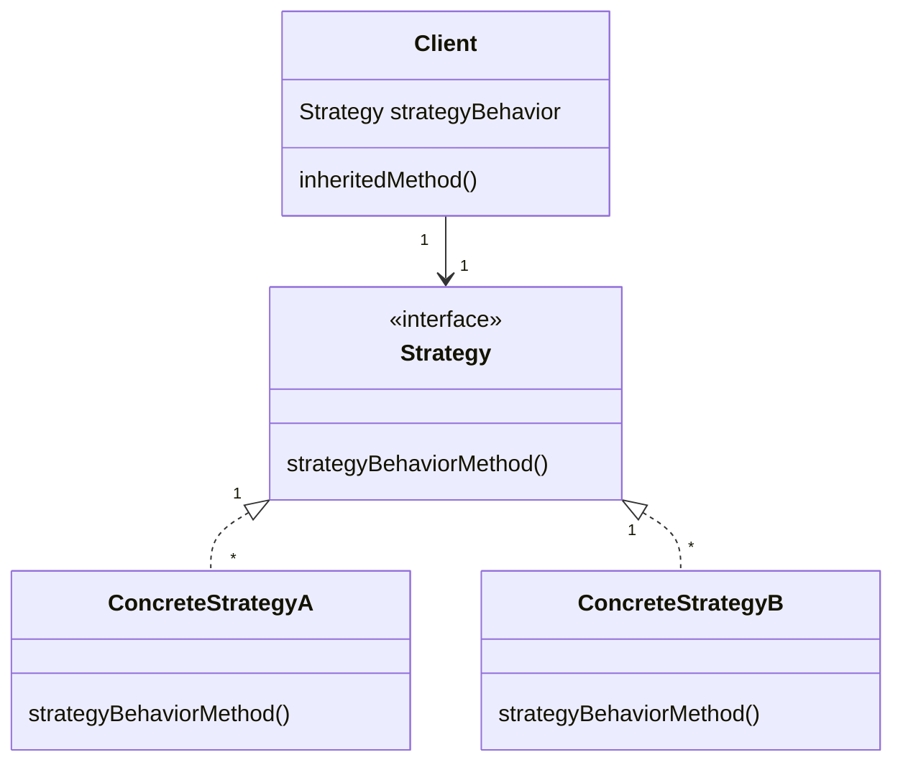

# Chapter 1: Strategy design pattern

> **Strategy**: defines a family of algorithms, encapsulates each one and makes them interchangeable. 
> Strategy lets the algorithm vary independently of clients that use it.

### Class Diagram

## Use in Python

The more pythonic approach in my mind is to define methods within an appropriate namespace
rather than classes;
this does not violate the above definition. The class-based approach is
needed in Java and has the advantage of explicitly setting out the required
method in an abstract base class.

An example from the standard lib is changing the text [completion method](https://docs.python.org/3/library/readline.html?highlight=set_#readline.set_completer)
from the readline module. This is used by the python REPL when we hit <button>TAB</button> in the REPL.
We can change the completion behavior via the `set_completer()` method, which takes a function
which replaces the current completion function. The function is used explicitly to set 
the required behavior.  
