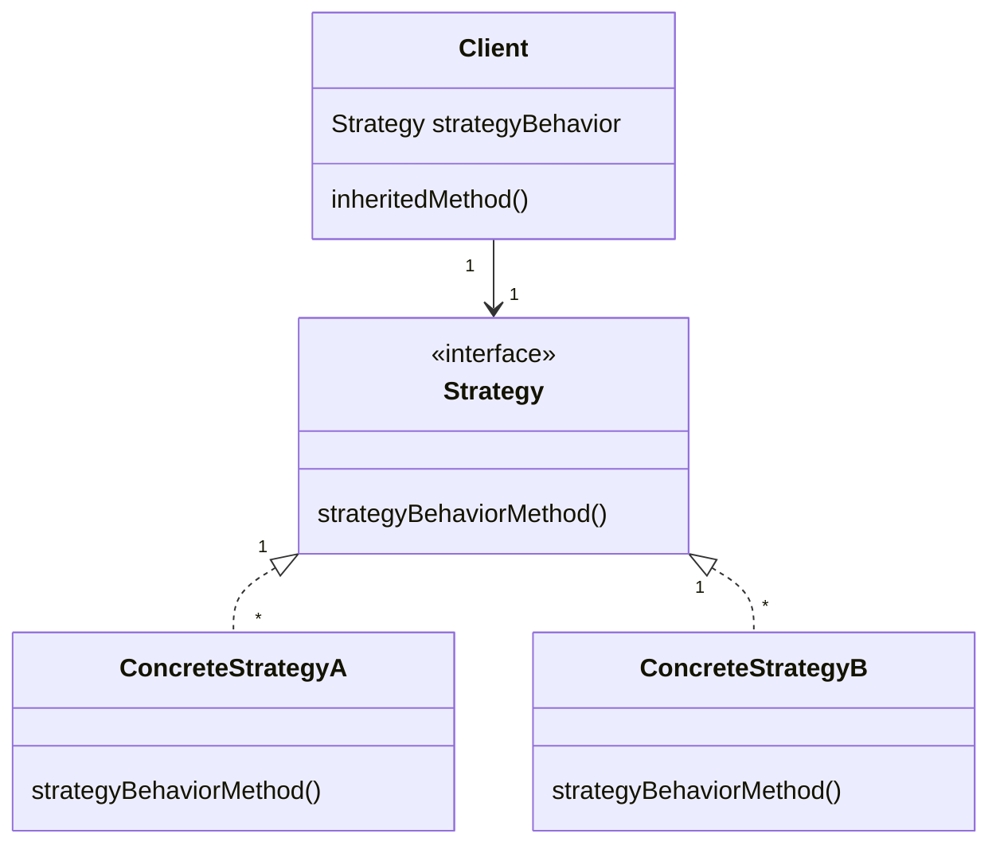

# Chapter 1: Strategy design pattern

> **Strategy**: defines a family of algorithms, encapsulates each one and makes them interchangeable. Strategy lets the algorithm vary independently from clients that use it.

Class Diagram (install mermaid to view)

## Use in Python

The more pythonic approach in my mind is to define methods rather than classes; this does not violate the above definition.  The class-based approach is needed in Java and has the advantage of explicitly setting out the required method in an abstract base class.

An example from the standard lib is the list `sort()` and `sorted()` methods with the use of an optional `key` parameter.  They invite the use of a sorting function or sorting "strategy", as do `min()` and `max()`. 
