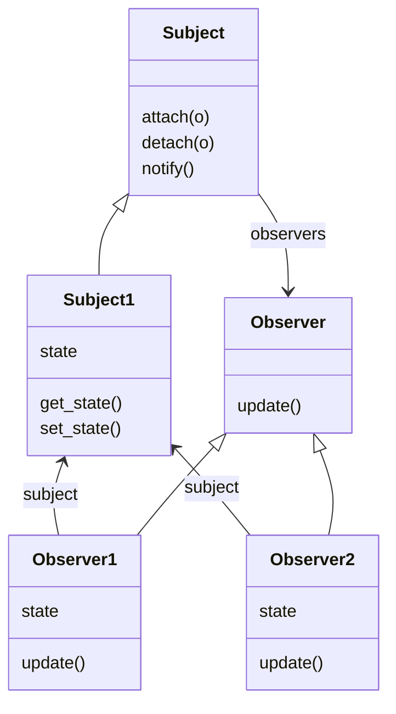

# Chapter 2: Observer design pattern

> **Observer**: defines a one-to-many dependency between objects so that when one object changes state, all of its
> dependents are notified and updated automatically.

A very useful design pattern, often used in user interfaces
and as part of the popular Model-View-Controller (MVC) pattern used,
for instance, in Django.
As I wrote out the code I found it very appealing that I did not need
to change the subject at all to add new observers.

### Class Diagram



## Running the code

```bash
python weather.py
```
