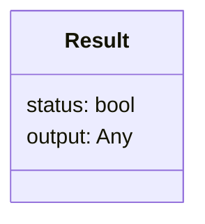

# Result Design Pattern

> **Result Pattern**: _(Bonus pattern not in the book)_ Defines an object representing
> both the
> status and the output of an operation.

A result object is a container for the result of an operation, which can be either a
success or a failure, together with the output of the operation. The result pattern
is a fundamental part of the Rust programming language in the form of the [Result enum][rust_result].

### Class Diagram



## Example

The filereader example uses the Result pattern to handle common errors reading and
parsing json files. It puts all file reading and parsing logic into a single
function, which returns a Result object. The calling code can check the status without
needing to understand the details of the error.

In this case we have correct files, a missing file and a bad file. All can be handled with the same
approach, in this case using the LBYL philosophy.

### Running the code

```bash
  python filereader.py
```

## Discussion

People often say that
in Python you should use exceptions - "Easier to Ask Forgiveness than Permission" (EAFP)
over guard clauses - "Look Before You Leap" (LBYL),
but the **Result design pattern** - returning an object which explicitly
states whether the operation succeeded is a useful alternative where error handling is required and
can be compatible with both approaches.

## Use in Python

The asyncio [Future object][asyncio_future] can be seen as a result object - it
represents the result of an asynchronous operation but rather than a success or failure it is either done or not done.
Confusingly it contains a `.result` attribute which is the output of the operation,
but is not the same as the Result object in the Result pattern.

The [requests library][requests] is often cited as a quintessentially
pythonic library - its [response object][response] (representing
the [HTTP response][http_response]) is essentially a **Result** object.
The [`raise_for_status()`][raise_for_status] method lets you easily use it with the EAFP philosophy.

[rust_result]: https://doc.rust-lang.org/std/result/enum.Result.html

[asyncio_future]: https://docs.python.org/3/library/asyncio-future.html#future-object

[raise_for_status]: https://docs.python-requests.org/en/latest/api/#requests.Response.raise_for_status

[requests]: https://docs.python-requests.org/en/latest/index.html

[response]: https://docs.python-requests.org/en/latest/api/#requests.Response

[http_response]: https://developer.mozilla.org/en-US/docs/Web/API/Response