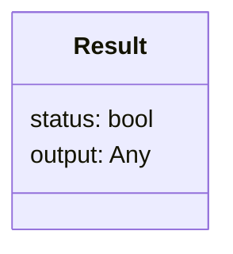

# Result Design Pattern

> **Result Pattern**: _(Bonus pattern not in the book)_ Defines an object representing
> both the
> status and the output of an operation.

A result object is a container for the result of an operation, which can be either a
success or a failure, together with the output of the operation. The result pattern
is a fundamental part of the Rust programming language.

### Class Diagram



## Running the code

```bash
python filereader.py
```


People often say you should use exceptions - "Easier to Ask Forgiveness than Permission" over guard clauses - "Look Before You Leap" but what about the Result design pattern - returning an object which explicitly states whether the operation succeeded (as used in Rust)?

The requests library is often cited as a quintessentially pythonic library - the response object in requests (representing a HTTP response) is essentially a Result object.  The raise_for_status() method lets you use it with the EAFP philosophy.
